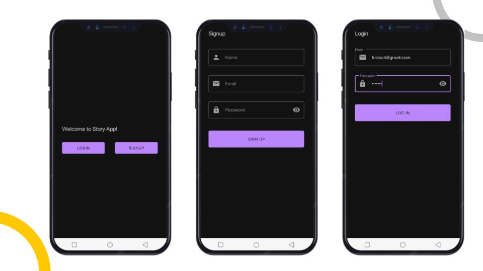
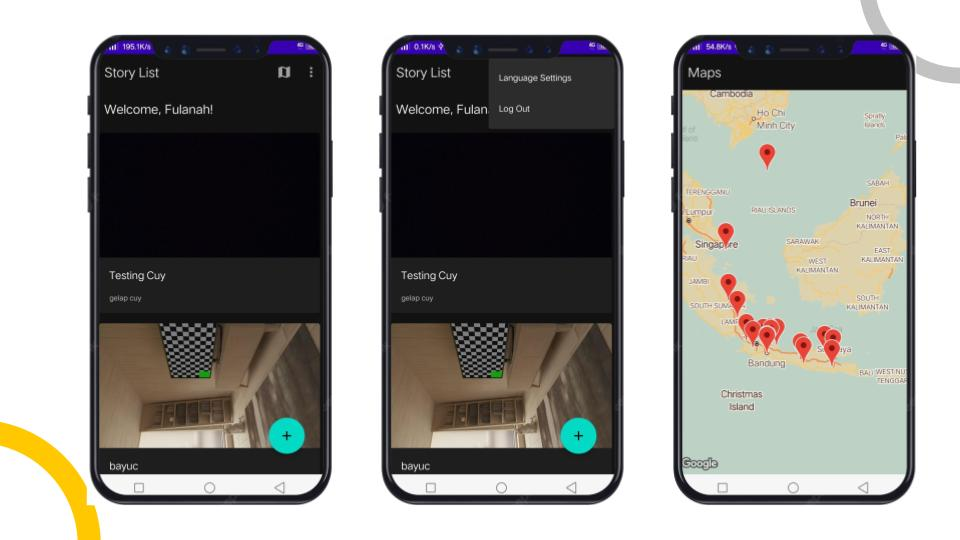
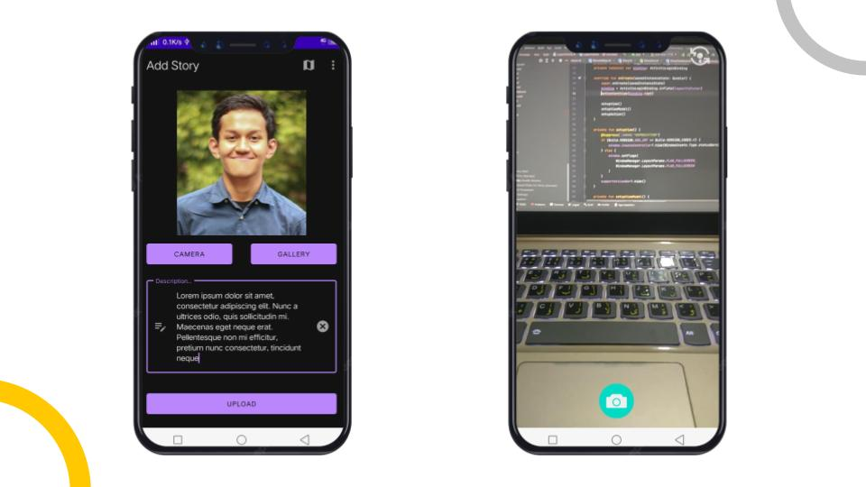

# Story App Android Application

## Preview

## List of Features
1. Welcome Page
2. Signup
3. Login
4. Story List
5. Language Settings (for localization)
6. Story Map
7. Add Story (with CameraX and Intent Gallery)

## Dependencies and Tools
1. Kotlin Extensions (Core, ViewModel, LiveData)
2. Glide
3. Material Design
4. Constraint Layout
5. CameraX
6. Retrofit
7. Kotlin Coroutines
8. RecylcerView, CardView
9. Datastore, preferences
10. Room
11. Paging3